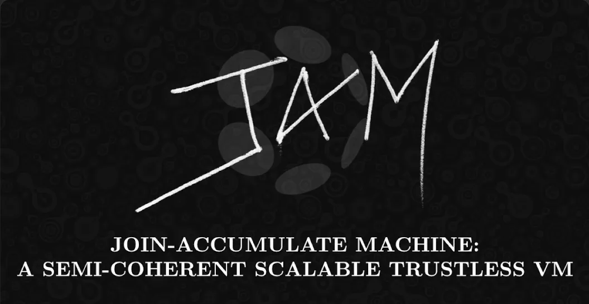

# Join-Accumulate Machine (JAM) in Rust

[](https://github.com/UniversalDot/JAM/actions/workflows/build.yml)
[](https://github.com/UniversalDot/JAM/actions/workflows/tests.yml)




This project provides an implementation of the Join-Accumulate Machine (Jam) in Rust, based on the concepts described in the graypaper. The implementation includes basic structures for smart contracts, core-time management, and an execution environment.

## Overview

The Join-Accumulate Machine (Jam) is a virtual machine designed to execute smart contracts with a focus on efficient core-time management. This project demonstrates the core components of Jam in a simplified form.

## Features

- **Smart Contract Structure**: Defines basic smart contract structure with code and state.
- **Core-Time Management**: Manages core-time allocation for contract execution.


## Getting Started

### Prerequisites

- Install Rust and Cargo by following the instructions on the [official Rust website](https://www.rust-lang.org/tools/install).

### Installation

1. **Clone the repository:**

    ```bash
    git clone https://github.com/UniversalDot/JAM.git
    cd JAM
    ```

2. Build the project**:
    
    ```sh
    cargo build
    ```

3. **Run the application:**

    ```bash
    cargo run
    ```

4. **Test the application:**

    ```bash
    cargo test
    ```

